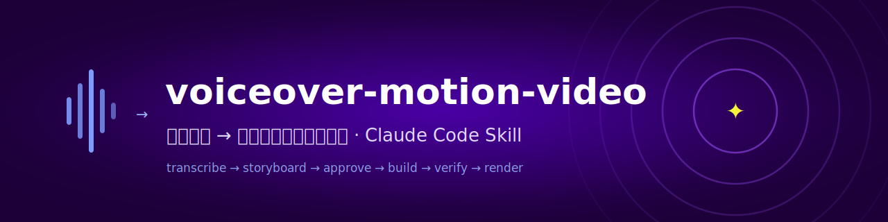
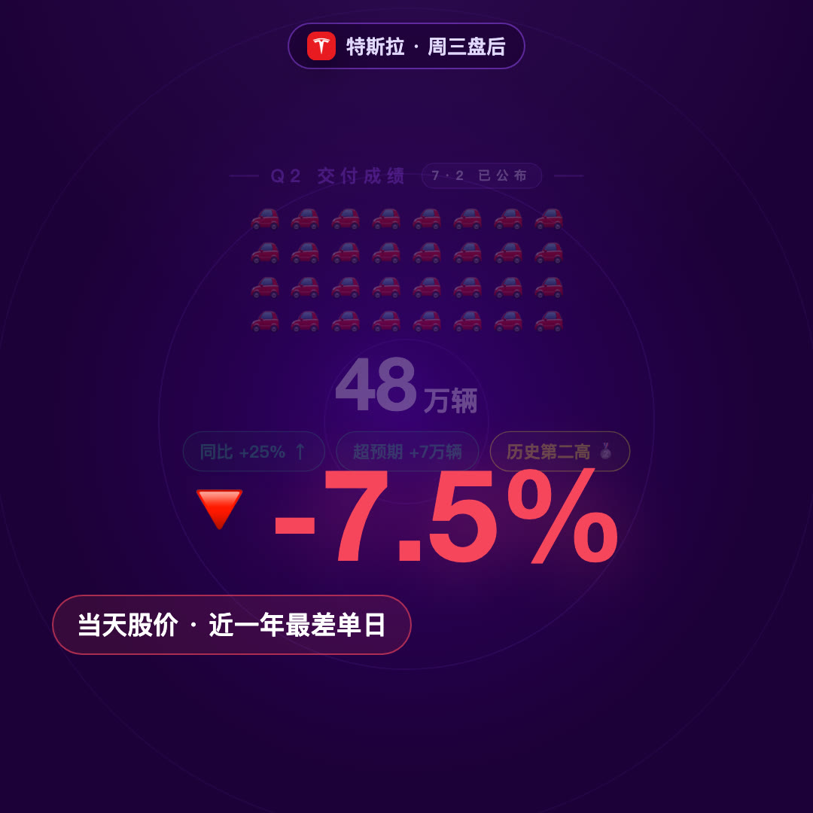
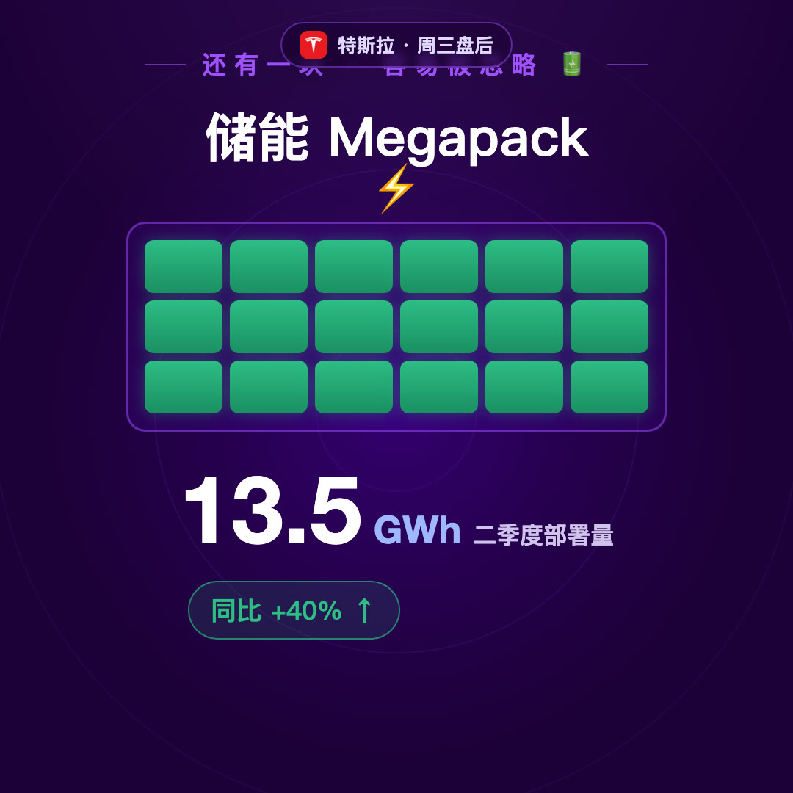
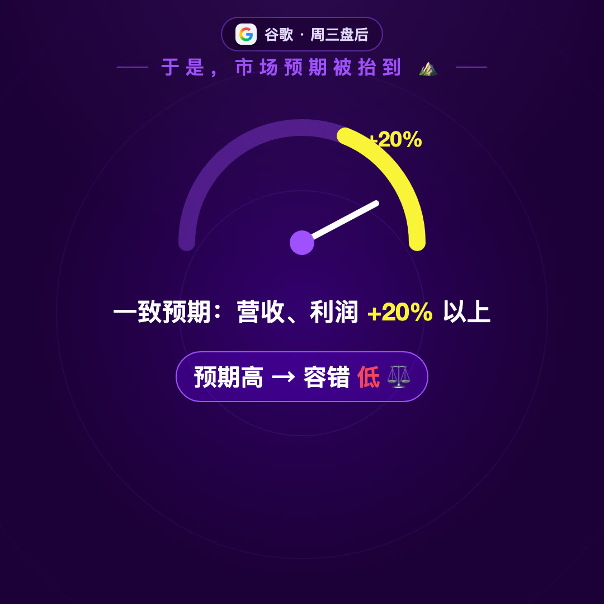
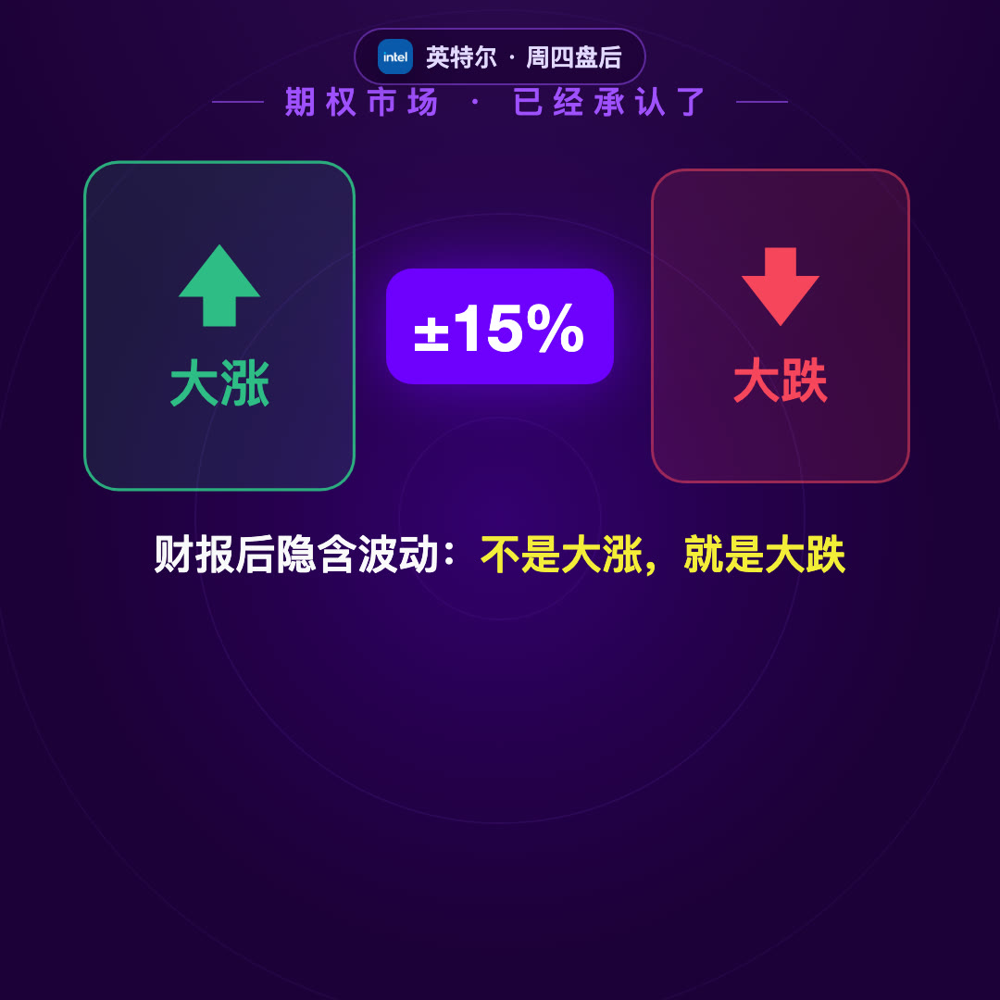
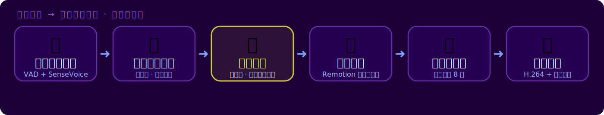

<p align="center">
  
</p>

<p align="center">
  <a href="LICENSE"></a>
  
  
  
</p>

**一条口播音频，产出一支品牌视觉的全屏动效解说视频。** 这是一个 [Claude Code](https://claude.com/claude-code) skill：把"转写 → 分镜 → 用户确认 → Remotion 搭建 → 静帧自查 → 渲染交付"整条流水线固化成可复用的工作流，屏幕上只有关键词、大数字、emoji 和 logo——画面服务理解，观众听的是你的原声口播。

> **EN**: A Claude Code skill that turns a voiceover audio track into a brand-styled, full-screen motion-graphics explainer video — transcribe with timestamps (SenseVoice), storyboard against the narration, build deterministic Remotion scenes, verify key frames, render. Docs are in Chinese; the code and workflow are language-agnostic.

## ✨ 成片效果

首个成片《Q2 美股财报周前瞻》：1080×1080 @30fps · 3'08" · 全程动效跟口播时间戳对齐。

| 开场日历 | 暴跌冲击 | 电池堆叠 |
|---|---|---|
|  |  |  |

| 预期仪表盘 | 隐含波动分屏 | 剧本决策树 |
|---|---|---|
|  |  |  |

*示例内容为美股财报解读，仅作演示，不构成投资建议。*

## 🧭 它怎么工作

<p align="center">
  
</p>

1. **带时间戳转写** — fsmn-vad 切段 + SenseVoice 识别（中文错误率低、CPU 快）；去气口音频的长语音段用**字符比例法**估算句级切点（±1s）
2. **分镜动效计划** — 视觉系统 + 逐段分镜表 + 待确认点（画面比例必须先定！）
3. **用户确认（硬闸门）** — 动效视频返工成本极高，计划没点头绝不写代码
4. **Remotion 场景搭建** — 每帧独立可计算（只依赖 `useCurrentFrame()`），时间轴常量统一进 `timeline.js`
5. **关键帧抽查** — 每场景渲 1-3 帧静帧过 8 项检查清单（溢出/重叠/残影/违和 emoji/连线对齐…）
6. **渲染交付** — H.264 + 原声口播，ffprobe 验证后回传

## 🚀 快速开始

### 作为 Claude Code skill 使用（推荐）

```bash
git clone https://github.com/<you>/voiceover-motion-video.git
mkdir -p ~/.claude/skills
cp -r voiceover-motion-video ~/.claude/skills/
pip install funasr soundfile   # 转写依赖（另需 ffmpeg）
```

然后在 Claude Code 里丢一条口播音频：

> @口播.mp3 用 remotion 根据这个音频做一条动效解说视频

Claude 会自动走完六步流程——先给你分镜计划，确认后才动工。

### 直接用 Remotion 模板

`template/` 是独立可跑的最小工程，内含示例视频**全部 10 个场景源码**（折线图逐帧绘制、象形阵列、仪表盘、硬币翻面、横滑快卡、决策树……即拿即抄）：

```bash
cd template && npm install
bash fetch_logos.sh                     # 拉公司 logo
cp 你的口播.mp3 public/audio/audio.mp3
npm run studio                          # 实时预览
npm run render                          # 出片
```

## 📁 仓库结构

```
voiceover-motion-video/
├── SKILL.md                     # skill 主流程（Claude 读这个干活）
├── scripts/
│   ├── transcribe_ts.py         # 带时间戳转写（VAD + SenseVoice）
│   └── align_marks.py           # 分镜切点计算（字符比例法 → 秒 + 帧号）
├── references/
│   ├── design-system.md         # 品牌 tokens · 动效语言 · 8 条踩坑清单
│   └── remotion-workflow.md     # 工程手册 · 组件速查 · 渲染命令
├── template/                    # 独立 Remotion 工程 + 示例视频全场景源码
└── assets/                      # README 配图
```

## 🎨 设计系统（示例品牌包，可整套替换）

| Token | 值 | 用途 |
|---|---|---|
| 深空紫 | `#1D0038` | 底色 + 涟漪母题 |
| 品牌紫 / 亮紫 | `#6F00FF` / `#A050FF` | 卡片、描边、转场 |
| 品牌黄 | `#F9F339` | **只给全片最关键的一两处** |
| 涨 / 跌 | `#2ebd85` / `#f6465d` | 固定不换 |

动效语言按"意图 → 动效"对照表组织（登场=弹簧、数字=count-up、冲击=overshoot+震屏、切换=涟漪擦除……），换品牌只需改 `theme.js` 一个文件。完整规范和 8 条真实踩坑（方块底 emoji 违和、拍间残影公式、PingFang 字重上限、连线对齐……）见 [references/design-system.md](references/design-system.md)。

## 📦 依赖

- **转写**：Python 3.10+，`funasr` + `soundfile`，ffmpeg（模型首次运行自动下载，~1GB，之后全离线）
- **渲染**：Node ≥ 18，Remotion 4.x（模板已锁版本）
- **emoji**：macOS 开箱即用；Linux 渲染需装 Noto Color Emoji 并自查静帧

## 🙌 Credits

- 由 [Claude Code](https://claude.com/claude-code) 全程构建（含本 README 和配图）
- ASR：[FunASR / SenseVoice](https://github.com/modelscope/FunASR) · 视频引擎：[Remotion](https://remotion.dev) · Logo CDN：[parqet](https://assets.parqet.com)

## License

[MIT](LICENSE)
