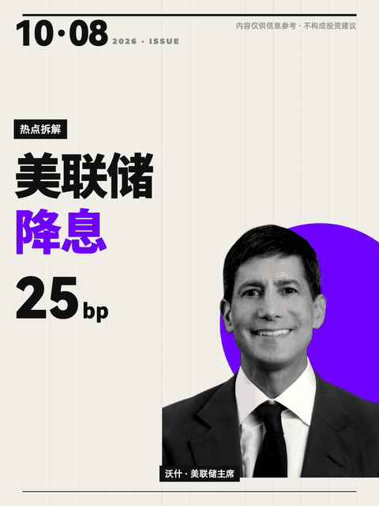
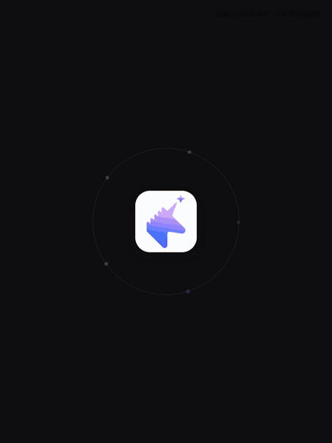
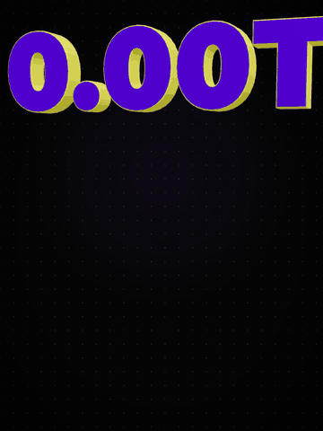

<p align="center"></p>

<h3 align="center">Tell Claude Code the topic. Get back a storyboard, a Remotion project, and a finished explainer video.</h3>

<p align="center">
  <a href="LICENSE"></a>
  <a href="https://github.com/wcy4213/voiceover-motion-video/stargazers"></a>
  
  
  
</p>

<p align="center">
  <b>English</b> · <a href="README.zh-CN.md">简体中文</a> &nbsp;|&nbsp;
  <a href="#what-it-made">Showcase</a> · <a href="#quick-start">Quick start</a> · <a href="#seven-visual-skins">Skins</a> · <a href="#motionkit">Engine</a> · <a href="#knowledge-films-no-voiceover">Knowledge films</a> · <a href="agent/SKILL.md">Agent docs</a>
</p>

**video-agent** is one Claude Code agent for the whole short-video pipeline: script → voiceover → an explicit *decision layer* (format × visual skin × technique × per-line shot grammar) → text storyboard you approve → deterministic Remotion scenes → pacing / cover-dedupe / art-direction QA → render → publish kit → retention-curve feedback. It shipped 44 finance explainers in 9 weeks on Douyin and Xiaohongshu. Code is language-agnostic; the agent docs are in Chinese (the account it was built for is Chinese).

<table>
<tr>
<td width="50%"><br/><sub><b>Knowledge film</b> · no voiceover, one-line captions are the script, cited sources, 16:9 + 9:16 from one storyboard</sub></td>
<td width="50%"><br/><sub><b>Same storyboard, another skin</b> · 7 contract skins, swap one import</sub></td>
</tr>
<tr>
<td><br/><sub><b>Acts & UI props</b> · color flood per act, cursor / toggle / chat bubble, scene shrinks into a card, mascot buddy</sub></td>
<td><br/><sub><b>3D / MG layer</b> · extruded numbers, coins, isometric data city, particles, floating cards</sub></td>
</tr>
</table>

## What you can build

- A 60–100 s vertical hot-take explainer from a voiceover MP3 (transcribe → align → storyboard → render)
- A 2–3 min **horizontal knowledge film with no voiceover** — captions carry the script, year HUD + citation corner + reference card (the format that is exploding under Douyin's #vibe知识大赏 tag)
- The same film in 9:16 and with English captions, from the same storyboard object
- A product-style ad with UI as props (cursor, toggles, chat bubbles), a persistent mascot and per-act color floods
- Finance-native shots: growing candlesticks, split-flap counters, ring percentages, flow lines, 3D bar cities

## Quick start

```bash
git clone https://github.com/wcy4213/voiceover-motion-video.git video-agent && cd video-agent
ln -s "$(pwd)/agent" ~/.claude/skills/video-agent          # the Claude Code skill (entry: agent/SKILL.md)
pip install funasr soundfile librosa numpy pillow && brew install ffmpeg
pnpm add remotion@4.0.438 @remotion/{cli,noise,paths,shapes,transitions,motion-blur,three,light-leaks,captions,lottie}@4.0.438 three@0.185 @react-three/fiber@9 @react-three/drei@10 three-globe lottie-web
bash public/fonts/fetch_fonts.sh                              # fonts not redistributable here (see public/fonts/README.md)
```

Then, in Claude Code:

> Make a 75-second Douyin video: "The Fed cut 25 bp and the S&P fell 1.2%". Hot-take line, terminal skin.

The agent answers with a **production sheet + text storyboard** (format, skin, main technique, one visual function per spoken line, what it carries across each cut) and does not touch code until you approve.

Or render a sample straight away:

```bash
REMOTION_ENTRY_POINT=./kfilm/index.jsx npx remotion still ./kfilm/index.jsx KF-rule37 out/f.png --frame=1150
REMOTION_ENTRY_POINT=./skins/_showcase/index.jsx npx remotion still ./skins/_showcase/index.jsx Showcase-terminal out/t.png --frame=130 --gl=angle
```

## What it made

<p align="center"></p>
<p align="center"><sub>Frame 0 of all 44 videos (frame 0 is the cover). The two blank purple tiles top-left are the July openings that got the account throttled for "batch-published homogeneous content" — the first-frame rules, cover dedupe and skin rotation all come from that.</sub></p>

<p align="center"></p>

Creator-dashboard snapshot as of 2026-10-07 (plays are back-end plays, not the public counter). Same account, same pipeline: the **education line out-pulls the hot-take line 21×** in median Douyin plays (9,212 vs 437). The videos that blew up all share "one counter-intuitive number + a historical pattern"; Xiaohongshu only rewards "a page worth saving". The full 44-row table with links and per-platform numbers is in the [Chinese README](README.zh-CN.md#44-支成片) and [`assets/videos.json`](assets/videos.json).

### Knowledge films (no voiceover)

<table><tr>
<td><br/><sub><b>The 37% rule</b> — how many companies to look at before you decide (optimal stopping, Flood 1949 → Chow et al. 1964)</sub></td>
<td><br/><sub><b>Survivorship bias</b> — funds on the leaderboard are the planes that came back (Wald 1943, SPIVA 2024: 33% of funds survive 20 years)</sub></td>
<td><br/><sub><b>The shape of interest rates</b> — 1694 → 2026 in nine stations (Bank of England 8% → Volcker 20% → 0 → 3.75–4%)</sub></td>
</tr></table>

Each is **~60 caption lines + 15 scene objects**, no scene code. The `kfilm/` engine renders a 1920×1080 and a 1080×1920 composition from one storyboard:

```js
export default {
  id: 'rule37', title: '37% 法则', tone: 'brown', duration: 158,
  acts: [12, 30, 56, 84, 118, 140],                 // act boundaries → gold-line wipes
  bobby: {at: 22.5, hold: 90},                      // brand callout inside the first 30 s
  captions: [{at: 0.3, text: '【37%】，也算出了：你该看到第几家'}, …],   // 【】 = gold keyword
  scenes: [
    {at: 0,  dur: 4.5, type: 'poster', props: {big: '37%', line1: '看多少家公司，才该下手', date: '2026 · 10 · 09'}},
    {at: 19, dur: 11,  type: 'doc',    props: {heading: '1949 · PRINCETON', lines: ['Merrill Flood…', {t: 'n / e ≈ 37%', big: true}]}, hud: {year: '1949'}, cite: 'Flood 1949 · Lindley 1961'},
    {at: 30, dur: 14,  type: 'curve',  props: {fn: 'xlnx', peakX: 1 / Math.E, peakText: '36.8% = 1/e'}},
    …
  ],
};
```

<p align="center"></p>

## How it works

<p align="center"></p>

- **Decision engine** (`agent/decide.md`): tag the content on 8 axes (intent, timeliness, abstraction, data shape, protagonist, footage, mood, platform) → pick a **format** (23, `agent/craft/formats.md`) × a **skin** (rotated against a ledger so consecutive videos never look alike) × a **main technique** (footage / data-viz / MG / 3D / stickers / screen-rec / AI-gen). Every spoken line gets a **visual function** (identify, hit-the-number, show-change, compare, mechanism, follow-the-money, turn, …) that maps to a shot grammar; every cut must name the element it carries across.
- **Step 4 is a hard gate**: the text storyboard is approved before a line of code.
- **QA that runs on the render**, not on taste: `pace_check` (visual events per 10 s, static stretches), `cover_diff` (pHash + palette + 4×4 layout fingerprint against every past cover — it catches the exact pair that got throttled, similarity 1.000), an art-direction scorecard run by a clean-context subagent, and after publishing `retention_curve` splits the drop-off into *hook leak / cliff / slide* and names what was on screen at each cliff.

## Seven visual skins

<p align="center"></p>

Every `skins/<id>/kit.jsx` exports the same 14 components (`Backdrop · Enter · Headline · Hero · Label · Delta · Mark · Stamp · Panel · Photo · DateMark · ChapterMark · Wipe · Disclaimer`); `skins/_showcase` renders one 3-beat storyboard through each. Terminal · Swiss grid · Liquid glass · Neo-brutal · UI-motion · Museum (dark gold, for knowledge films) · Black dot-grid · Analyst notebook.

<p align="center"></p>

## motionkit

<p align="center"></p>
<p align="center"></p>

| | |
|---|---|
| Camera · seams · acts | `Camera / Punch / Parallax` · `Shot` (cut-the-curve / zoom-through / pull) · `LeakAt` light leak · `ColorFlood` per-act background · `Carry` shared element across scenes · `NestZoom` scene-becomes-a-card |
| MG · finance · UI | `Morph · Burst · Ring · FlowLine · KineticWords · LiquidReveal · Lottie` · `Candles` · `SplitFlap` · `Cursor · SelectionBox · Toggle · ChatBubble · StickerPill · OrbitRing` · `BobbyBuddy` |
| 3D · sound · type | `Number3D · Coin3D · IsoCity3D · Particles3D · Card3D · Bars3D · Globe3D` (render with `--gl=angle`) · `SfxTrack` + 7 procedurally synthesized SFX (zero-license) · `type.js`: 19 display fonts, 8 pairings, an ads-safe set |

Every module has a renderable demo under `motionkit/demo-*`. Everything is frame-deterministic (`useCurrentFrame` only — Remotion renders frames in parallel and out of order).

## Why this instead of…

| | video-agent | remotion-dev/skills | HyperFrames | OpenMontage |
|---|---|---|---|---|
| What it is | end-to-end agent + engine for one account's content line | official Remotion API best practices | HTML/GSAP → video framework with agent skills | agentic production system over AI video providers |
| Decides *what the video should look like* | yes — format × skin × technique × per-line shot grammar, rotated against a ledger | no (API guidance) | house style per FRAME.md | pipeline templates |
| Ships skins + components | 7 skins, 40+ components, 3D, SFX | — | 180 registry blocks | — |
| QA on the rendered file | pacing, cover dedupe, retention curve | — | lint / check | quality gates |
| Platform compliance baked in | CN platforms (no trading demos, no fake celebrities, no money visuals) + ad-review rules | — | — | — |
| Evidence | 44 shipped videos with platform metrics in-repo | — | showcase | showcase |
| License | MIT | Remotion license | Apache-2.0 | AGPL-3.0 |

We use `remotion-dev/skills` ourselves (pinned to the commit matching Remotion 4.0.438) and borrowed motion doctrine from HyperFrames, motionmaxxing, video-shotcraft and LottieFiles — credited below. This repo is the layer above them: *which* video to make and *how to judge the result*.

## Try these prompts

```text
把这条口播做成 1084×884 的动效视频，黑底点阵皮肤，去气口 1.3         # voiceover MP3 → motion video
写一条《基金榜单上的幸存者偏差》横屏知识短片，无口播，museum 皮肤      # knowledge film from a topic
换个没用过的风格                                                       # rotate skin against the ledger
这条为什么完播低？                                                     # retention_curve + pace_check diagnosis
审一下这三帧的画面                                                     # art-direction scorecard
```

## A note from the author

This started as one skill that turned an MP3 into a motion-graphics video. Nine weeks and 44 videos later the hard part was never the rendering — it was deciding what each video should be, keeping consecutive videos from looking the same, and finding out *from the data* what actually held viewers. Everything in `agent/` is the written-down version of those arguments: rules carry the date they were learned. The repository is the public version of a live production line, so some internal files (the dated rejection log, script corpora, vendor docs, licensed fonts) are not distributed; `agent/rules/requirements.md` explains what is missing and why.

## Repository

```
agent/        Claude Code skill — SKILL.md entry · decide.md · craft/ (formats · retention · art-direction · skins · fonts-license) · pipelines/ · script/ · scripts/
motionkit/    shared components + demos          skins/      7 contract skins + _showcase
kfilm/        knowledge-film engine + 3 films    public/     OFL fonts · synthesized SFX · brand logos
template/     minimal standalone Remotion project (v1 example)       assets/   README images · 44 covers · videos.json
```

## Changelog

| | | |
|---|---|---|
| **v5** | 2026-10-09 | one agent, decision engine, 23 formats, retention & art-direction handbooks, 7 skins, type system with per-font license audit, 3D / MG / SFX / acts / UI props, pacing + cover-dedupe + retention QA, beat grid, `kfilm` knowledge-film engine with 3 films, two Douyin benchmarks (585 + 245 videos) |
| v4 | 09-02 | dot-grid & notebook skins, motionkit, burned-in captions, layout linter, live-footage opening template |
| v3 | 07-24 | first-frame anti-homogenization spec (after being throttled), B-roll pipeline with copyright red lines |
| v2 | 07-22 | transition hierarchy, caption safe zone, text limits, overshoot cap, executive-quote component |
| v1 | 07-21 | transcribe → storyboard → approve → Remotion → stills → render; first video |

## Community

Issues and Discussions are open. If you ship something with it, open a Discussion with the link — the showcase in the next version will be built from those.

<p align="center"><a href="https://star-history.com/#wcy4213/voiceover-motion-video&Date"></a></p>

<sub>**License** — code and docs MIT. Only SIL OFL fonts are redistributed; the rest download from their official pages via `public/fonts/fetch_fonts.sh` (per-font audit in `agent/craft/fonts-license.md`). SFX are procedurally generated. Remotion requires a Company License for for-profit teams above 3 people — check your status. Example content is market commentary / investor education for demonstration only and is not investment advice.<br/>
**Credits** — built end-to-end with [Claude Code](https://claude.com/claude-code) · [FunASR / SenseVoice](https://github.com/modelscope/FunASR) · [Remotion](https://remotion.dev) · [three.js](https://threejs.org) · [librosa](https://librosa.org) · motion doctrine: [remotion-dev/skills](https://github.com/remotion-dev/skills) · [heygen-com/hyperframes](https://github.com/heygen-com/hyperframes) · [Tejashmakwana/motionmaxxing](https://github.com/Tejashmakwana/motionmaxxing) · [Vincentwei1021/video-shotcraft](https://github.com/Vincentwei1021/video-shotcraft) · [LottieFiles/motion-design-skill](https://github.com/LottieFiles/motion-design-skill) · [vibe-motion/skills](https://github.com/vibe-motion/skills)</sub>
