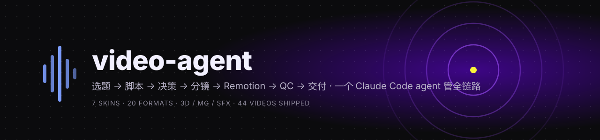
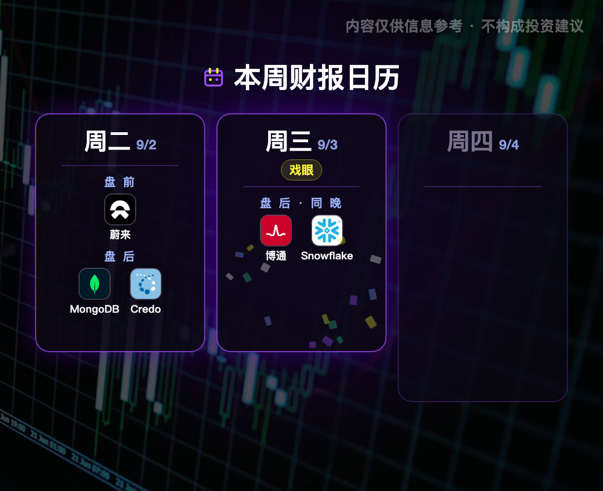
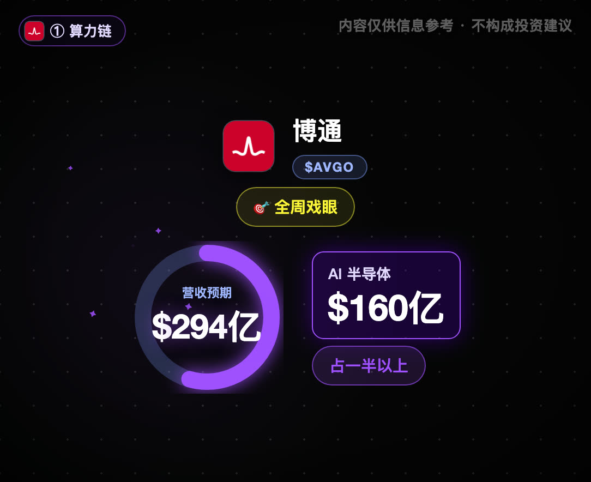
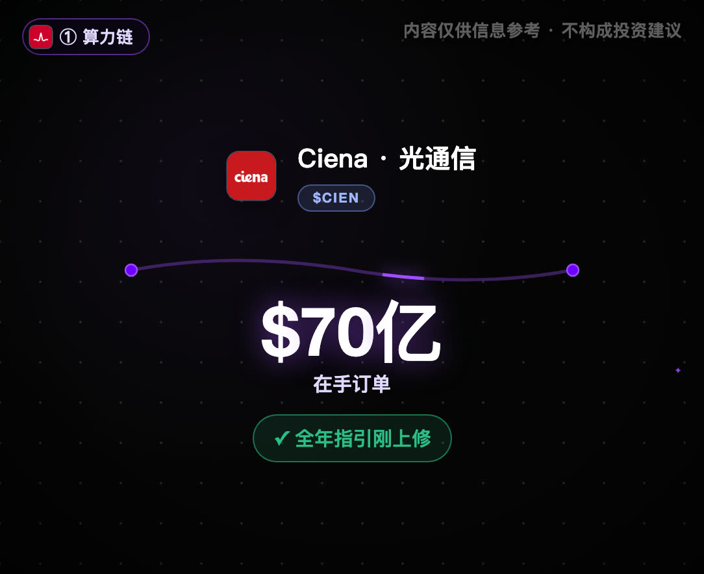
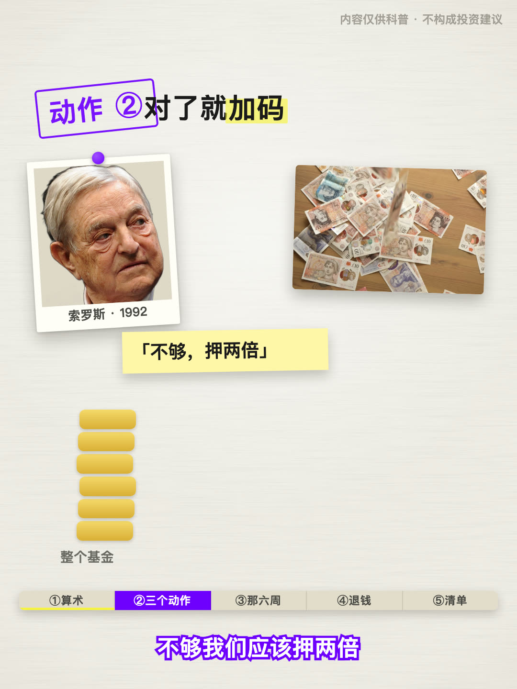
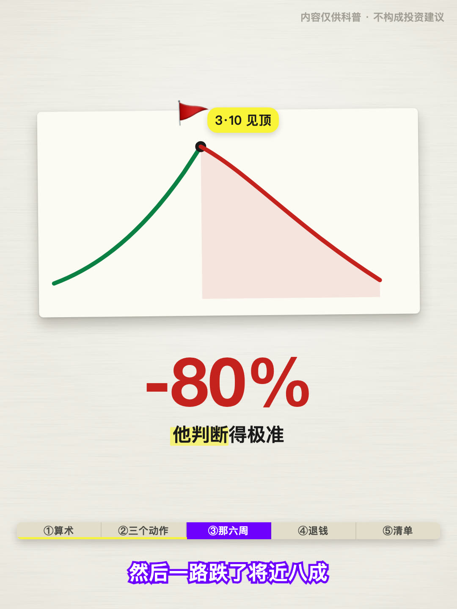
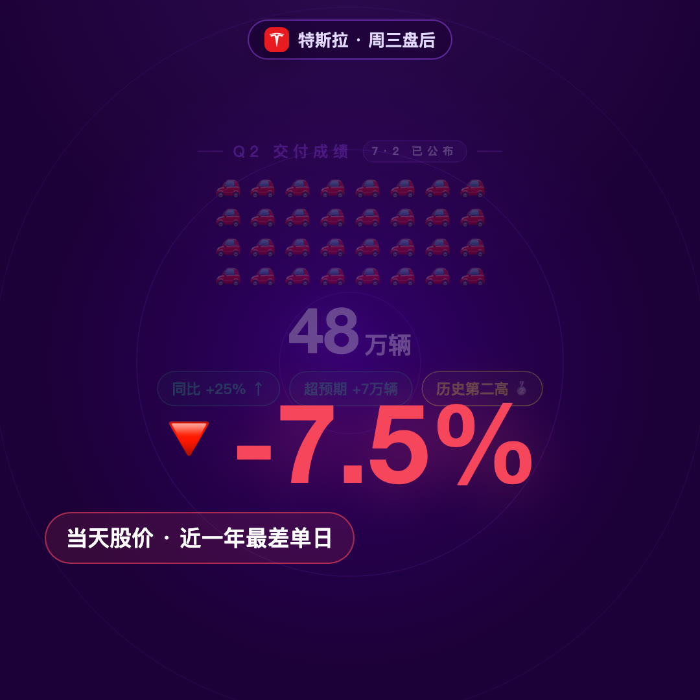
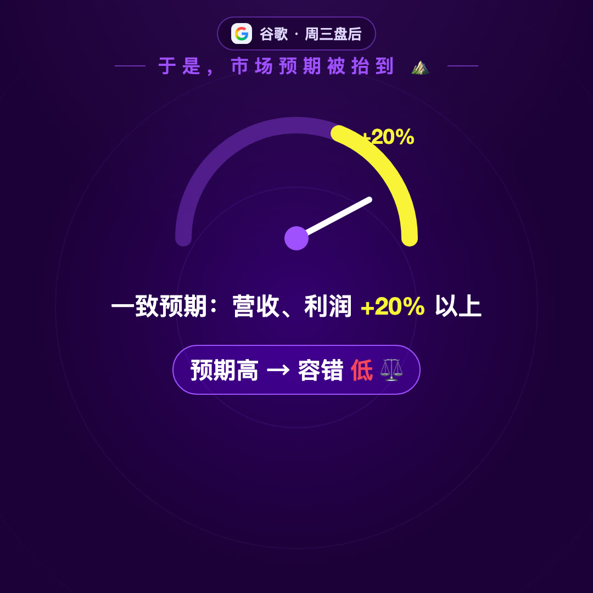
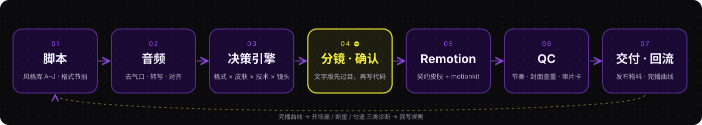

<p align="center">
  
</p>

<p align="center">
  <a href="LICENSE"></a>
  
  
  
</p>

**一条口播音频，产出一支品牌视觉的全屏动效解说视频。** 这是一个 [Claude Code](https://claude.com/claude-code) skill：把"转写 → 分镜 → 用户确认 → Remotion 搭建 → 静帧自查 → 渲染交付"整条流水线固化成可复用的工作流，屏幕上只有关键词、大数字、emoji 和 logo——画面服务理解，观众听的是你的原声口播。内置**两套视觉皮肤**（黑底点阵投研风 / 分析师手账纸面风）、跨视频共享动效库 motionkit（含 3D 层）、烧录字幕管线和排版自动质检。

> **EN**: A Claude Code skill that turns a voiceover audio track into a brand-styled, full-screen motion-graphics explainer video — transcribe with timestamps (SenseVoice), storyboard against the narration, build deterministic Remotion scenes, verify key frames, render. Docs are in Chinese; the code and workflow are language-agnostic.

## ✨ 成片效果

### 皮肤① 黑底点阵（投研线，`skins/black-dotgrid/`）

《财报周前瞻》1084×884 @30fps · 3'44" · 近黑底+紫点阵漂移光晕，全程动效跟口播时间戳对齐：

| 财报日历 + 实拍背景层 | 仪表盘 + 章节标签 | 折线画出 + 判词 |
|---|---|---|
|  |  |  |

### 皮肤② 分析师手账（投教线，`skins/paper/`）

《德鲁肯米勒 30 年不亏损》1080×1440 · 6'08" · 米白纸底+墨字+荧光笔+印章+烧录字幕，观感是"一页值得收藏的笔记"：

| 拍立得 + 便签 + 实拍窗 | 手绘图表 + 荧光笔 | 印章 + 象形阵列 |
|---|---|---|
|  |  |  |

### 初代示例（`template/` 完整工程，旧深空紫皮肤）

首个成片《Q2 美股财报周前瞻》1080×1080 · 3'08"，10 个场景源码全在 `template/`：

| 开场日历 | 暴跌冲击 | 预期仪表盘 |
|---|---|---|
|  |  |  |

*示例内容为美股财报/投教解读，仅作演示，不构成投资建议。*

## 🧭 它怎么工作

<p align="center">
  
</p>

1. **带时间戳转写** — fsmn-vad 切段 + SenseVoice 识别（中文错误率低、CPU 快）；去气口音频的长语音段用**字符比例法**估算句级切点（±1s）
2. **分镜动效计划** — 视觉系统 + 逐段分镜表 + 待确认点（画面比例必须先定！）
3. **用户确认（硬闸门）** — 动效视频返工成本极高，计划没点头绝不写代码
4. **Remotion 场景搭建** — 每帧独立可计算（只依赖 `useCurrentFrame()`），时间轴常量统一进 `timeline.js`
5. **关键帧抽查** — 每场景渲 1-3 帧静帧过 8 项检查清单（溢出/重叠/残影/违和 emoji/连线对齐…）
6. **渲染交付** — H.264 + 原声口播，ffprobe 验证后回传

## 🚀 快速开始

### 作为 Claude Code skill 使用（推荐）

```bash
git clone https://github.com/<you>/voiceover-motion-video.git
mkdir -p ~/.claude/skills
cp -r voiceover-motion-video ~/.claude/skills/
pip install funasr soundfile   # 转写依赖（另需 ffmpeg）
```

然后在 Claude Code 里丢一条口播音频：

> @口播.mp3 用 remotion 根据这个音频做一条动效解说视频

Claude 会自动走完六步流程——先给你分镜计划，确认后才动工。

### 直接用 Remotion 模板

`template/` 是独立可跑的最小工程，内含示例视频**全部 10 个场景源码**（折线图逐帧绘制、象形阵列、仪表盘、硬币翻面、横滑快卡、决策树……即拿即抄）：

```bash
cd template && npm install
bash fetch_logos.sh                     # 拉公司 logo
cp 你的口播.mp3 public/audio/audio.mp3
npm run studio                          # 实时预览
npm run render                          # 出片
```

## 📁 仓库结构

```
voiceover-motion-video/
├── SKILL.md                     # skill 主流程（Claude 读这个干活）
├── scripts/
│   ├── transcribe_ts.py         # 带时间戳转写（VAD + SenseVoice）
│   ├── align_tokens.py          # 分镜切点精确对齐（token 级时间戳，正片用这个）
│   ├── align_marks.py           # 字符比例法估时（已弃用于正片，仅临时估算）
│   ├── make_subs.py             # 烧录字幕轨生成（token 对齐 → subs.js）
│   ├── broll_fetch.py           # B-roll 素材搜采/质检/2.5D运镜（四源 + 防复用台账）
│   ├── depthflow_animate.py     # 静图 → 2.5D 视差运镜视频（DepthFlow）
│   ├── make_outline.py          # 抠图 → WindOutline 风动描边素材对
│   ├── overlap-check.mjs        # 排版自动质检：逐帧扫元素重叠 + 出框
│   └── qc-stills.mjs            # 一次 bundle 批量抽帧 QC
├── references/
│   ├── design-system.md         # 品牌 tokens · 动效语言 · 首帧/封面规范 · 踩坑清单
│   ├── remotion-workflow.md     # 工程手册 · 组件速查 · 渲染命令
│   ├── three-motion.md          # 3D 动效手册（three.js/Globe3D/Bars3D + 确定性坑）
│   └── broll-assets.md          # 实拍素材规范：配额 · 分镜映射 · 信源与版权红线 · 防复用
├── skins/
│   ├── black-dotgrid/           # 皮肤①黑底点阵（投研线默认）：Fx/fun/ui/TickerChip/字幕/水印
│   └── paper/                   # 皮肤②分析师手账（投教线）：纸面组件全家桶 + 翻页转场
├── motionkit/                   # 跨视频共享动效库：enter presets/点阵背景/KenBurns/DrawSVG + three 3D
├── template/                    # 独立 Remotion 工程 + 示例视频全场景源码（旧紫底皮肤）
└── assets/                      # README 配图
```

## 🎭 两套视觉皮肤

| | 黑底点阵（投研线默认） | 分析师手账（投教线） |
|---|---|---|
| 底 | 近黑 `#050505` + 紫点阵漂移光晕 | 暖米白纸 `#F2EFE8` + 纤维噪点 |
| 观感 | 数据终端 / 突发新闻 | 一页值得收藏的笔记 |
| 招牌组件 | CRT 雪花电视闪回、Glitch 故障转场、WindOutline 风动描边、MoneyRain/SlamStamp 趣味层 | 纸卡拍落、拍立得+图钉、荧光笔扫过、红笔手绘圈、印章、翻页转场 |
| 大章转场 | 涟漪擦除 | 翻页 PageFlip |
| 适用 | 财报解读、热点拆解、公司复盘 | 概念/方法论投教 |

用法与设计纪律见 [skins/black-dotgrid/README.md](skins/black-dotgrid/README.md) 和 [skins/paper/README.md](skins/paper/README.md)。两套皮肤共享 `motionkit/`（语义入场 preset、DotGridBackdrop、KenBurns、DrawSVG 图标线稿、3D 地球/柱阵）。

## 🎨 设计系统（示例品牌包，可整套替换）

| Token | 值 | 用途 |
|---|---|---|
| 近黑底 | `#050505` | 投研线底色（+点阵光晕；旧深空紫 `#1D0038` 见 template/） |
| 纸底 | `#F2EFE8` | 投教线底色（+纤维噪点） |
| 品牌紫 / 亮紫 | `#6F00FF` / `#A050FF` | 卡片、描边、转场、点阵 |
| 品牌黄 | `#F9F339` | **只给全片最关键的一两处**（纸面皮肤=荧光笔） |
| 涨 / 跌 | 深底 `#2ebd85`/`#f6465d` · 纸底 `#0B8043`/`#C5221F` | 固定不换 |

动效语言按"意图 → 动效"对照表组织（登场=弹簧、数字=count-up、冲击=overshoot+震屏、切换=涟漪擦除……），换品牌只需改 `theme.js` 一个文件。完整规范和 8 条真实踩坑（方块底 emoji 违和、拍间残影公式、PingFang 字重上限、连线对齐……）见 [references/design-system.md](references/design-system.md)。

## 🔁 迭代记录

**v4 · 2026-09-02**（7 月底至 9 月初 20+ 支成片的沉淀：两套新皮肤 + 共享动效库 + 自动质检）：

- **皮肤①黑底点阵（skins/black-dotgrid/）** — 投研线弃紫底改近黑+点阵，紫色降级为元素色；新特效 CRT（真实访谈视频包进雪花电视=老录像既视感）、Glitch（暗闪+细撕裂线，实心大色块会把整屏糊成灰）、WindOutline（抠图风动描边）；fun.jsx 14 个趣味组件落地"每场一个图形主角、万物皆动"
- **皮肤②分析师手账（skins/paper/）** — 投教线独立纸面皮肤：米白纸底+墨字+荧光笔+红笔+印章+翻页转场；封面走"纸面+拍立得实拍窗口"，与黑底封面肉眼可辨区分
- **motionkit/ 共享动效库** — enter/exit 语义 preset（10 种入场，过冲钳制）、DotGridBackdrop、KenBurns、DrawSVG 图标线稿 + three/ 3D 层（Globe3D 地球、Bars3D 柱阵，`--gl=angle`、three-globe 确定性坑已封死）
- **烧录字幕管线** — align_tokens.py（token 级时间戳，字符比例法在去气口音频上实测漂 4s 已弃用）+ make_subs.py（ASR 错字锚点→改正文本）+ 两套皮肤各自的 Subtitle 组件
- **排版自动质检** — overlap-check.mjs 逐帧扫 DOM 包围盒（4 类假阳性抑制：墨迹框/嵌套/裁切/3D 翻面），肉眼抽帧必漏的重叠和出框全抓出来；qc-stills.mjs 批量抽帧提速
- **实拍开场标准模板（design-system.md §1.5.1）** — 主角实拍打底+左黑区渐变+日期章+大标题，frame 0 完整、frame 1 起强冲击动画
- **免责水印全片常驻** — Disclaimer 组件挂顶层，交付前抽 3 帧验收；只放片尾不合规

**v3 · 2026-07-24**（连续多期同款开场被抖音判"批量发布违规或低质内容"限流后，针对平台查重机制的一轮硬迭代）：

- **首帧/封面规范（design-system.md §1.5）** — frame 0 就是封面也是查重重点：必须排版完整（日期章 + rembg 抠图主视觉 + 标题）、构图条条不同；S0 拆"封面拍"，渲 `--frame=0` 验收并存档比对。根因：开场全靠 spring 从 0 弹入 → 首帧全是同款空底
- **B-roll 实拍素材管线（broll_fetch.py + broll-assets.md）** — 动效为主、每期掺 2–3 处实拍/图片点缀（品牌卡片画中画 / 压暗背景层 / Ken Burns 图片）。四源搜采：Pexels/Pixabay API（免费可商用）、Openverse（CC 过滤）、YouTube（yt-dlp 切区间，美联储/国会官方频道=公有领域）；ledger.json 台账防跨期复用撞指纹
- **版权红线写进规范** — 只从源头拿无水印素材；绝不抹他人水印台标（著作权法 §53(7)）；Pexels 简介署名、CC BY 素材署名作者、AI 素材主动标注

**v2 · 2026-07-22**（第二支成片《谷歌 Q2 财报前瞻》3'44" 落地后，按真实用户反馈迭代）：

- **转场分层级** — 只有大章节切换用径向擦除（前后各 10 帧），小节切换硬切；首版全部切点都上 14 帧擦除，被反馈"转场时间都很长"
- **字幕安全区** — 底部 ~170px 默认不放内容（贴底元素 `bottom ≥ 175`），给用户后期字幕留位
- **文字上限** — 卡片只留一行主文案、副标题默认不加、chip ≤10 字；屏幕文字宁少勿多
- **入场过冲 ≤1.3** — 更大的 spring 过冲会让元素入场瞬间放大出框
- **新组件 `ExecQuote`** — 高管/名人抠图出场（照片侧滑入 + 引言气泡 + 姓名牌），配套 rembg 抠图素材流程写进 design-system.md
- **踩坑清单 +2** — 拍容器必须 flex 居中（svg/块级子元素否则全靠左）；带底色 emoji 黑名单扩充与可用白名单

## 📦 依赖

- **转写**：Python 3.10+，`funasr` + `soundfile`，ffmpeg（模型首次运行自动下载，~1GB，之后全离线）
- **渲染**：Node ≥ 18，Remotion 4.x（模板已锁版本）
- **素材抓取（可选）**：`pip install "yt-dlp[default]"`（YouTube 下载）；Pexels / Pixabay 免费 API key（图库搜采，纯标准库调用无额外依赖）
- **emoji**：macOS 开箱即用；Linux 渲染需装 Noto Color Emoji 并自查静帧

## 🙌 Credits

- 由 [Claude Code](https://claude.com/claude-code) 全程构建（含本 README 和配图）
- ASR：[FunASR / SenseVoice](https://github.com/modelscope/FunASR) · 视频引擎：[Remotion](https://remotion.dev) · Logo CDN：[parqet](https://assets.parqet.com)

## License

[MIT](LICENSE)
