<p align="center"></p>

<p align="center"><a href="README.md">English</a> · <b>简体中文</b></p>

<p align="center">
  <a href="LICENSE"></a>
  
  
  
</p>

**一个 Claude Code agent，从选题到成片管全链路**：写口播 → 去气口 → 自主判定格式 / 皮肤 / 技术 / 每句镜头手法 → 文字分镜（你确认）→ Remotion 搭场景 → 节奏体检 / 封面查重 / 审片卡 → 渲染 → 发布物料 → 完播曲线回流。2026-07-21 到 09-24 用它连续产出 **44 支**财经解说视频，本仓库是这条生产线的公开版。

> **EN** — One Claude Code agent for the whole finance-explainer pipeline: script → voiceover → decision layer (format × skin × technique × per-line shot grammar) → storyboard → deterministic Remotion scenes → pacing / cover-dedupe / art-direction QA → render → publish kit → retention feedback. 44 videos in 9 weeks. Docs in Chinese, code language-agnostic.

<sub>示例内容为美股/港股投研与投教解读，仅作演示，不构成投资建议。</sub>

<br/>

## 44 支成片

<p align="center">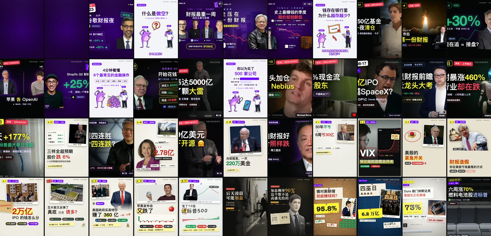</p>
<p align="center"><sub>每支的 frame 0 即封面。左上两格空紫底是 07-22 被平台判"批量同质化"限流的那一代——之后的首帧规范、封面查重、皮肤轮换都从这里来。</sub></p>

<p align="center">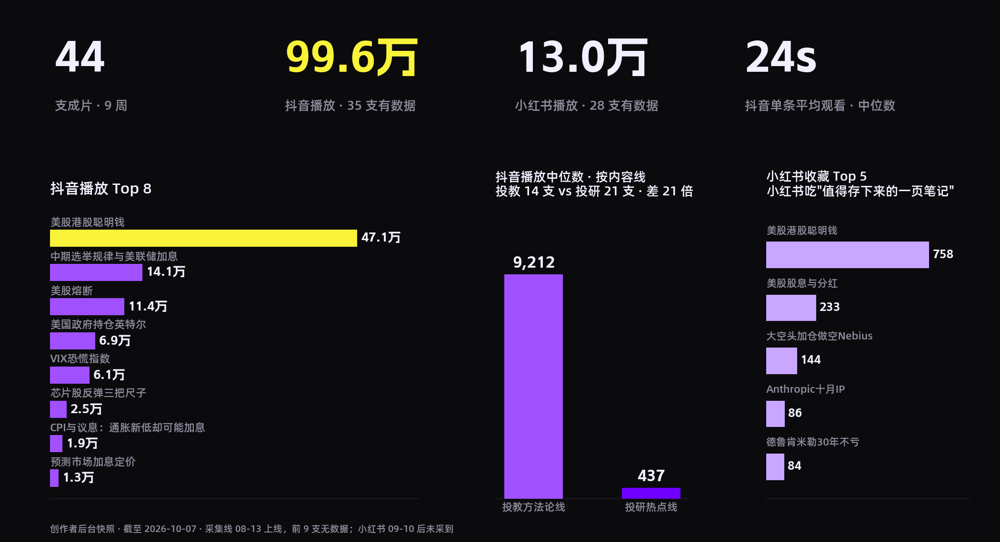</p>

<p align="center">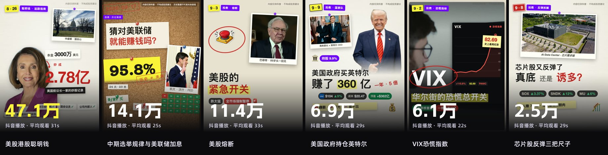</p>

同一个账号、同一条流水线，**选题线别决定了二十倍的差距**：投教方法论线抖音播放中位 9,212，投研热点线 437。爆的全是"一个反直觉数字 + 历史规律"；小红书只认"值得存下来的一页笔记"。节奏体检回测过：剪得快慢解释不了播放，开场第一句才是主变量。

<details>
<summary><b>44 支明细</b>（封面 · 日期 · 选题 · 皮肤 · 双平台数据 · 链接）。数据 = 创作者后台快照截至 2026-10-07；采集线 08-13 上线，前 9 支无数据，小红书 09-10 后未采到。完整字段见 <code>assets/videos.json</code></summary>

| 封面 | 日期 · 选题 | 皮肤 | 抖音 播放 · 赞 | 小红书 播放 · 藏 | |
|---|---|---|---|---|---|
|  | 07-21 **Q2财报周前瞻** | 紫底涟漪 | — · — | — · — | [抖音](https://www.douyin.com/video/7664934085000793390) [小红书](https://www.xiaohongshu.com/explore/6a5f50e7000000001d022c96) |
|  | 07-22 **谷歌Q2财报前瞻** | 紫底涟漪 | — · — | — · — | [抖音](https://www.douyin.com/video/7665329047022472475) [小红书](https://www.xiaohongshu.com/explore/6a60b837000000000c015fe3) |
|  | 07-23 **谷歌Q2财报分析** | 紫底涟漪 | — · — | — · — | [抖音](https://www.douyin.com/video/7665677683182898484) [小红书](https://www.xiaohongshu.com/explore/6a61ecf2000000001b01db20) |
| 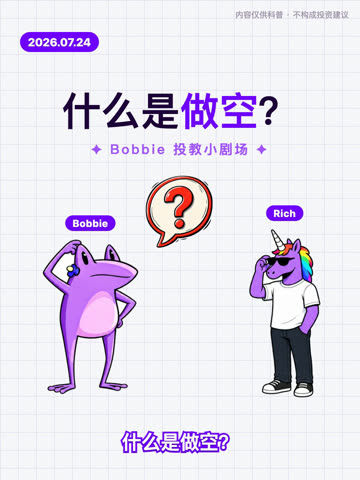 | 07-24 **什么是做空** | 贴纸动画 | — · — | — · — | [抖音](https://www.douyin.com/video/7666042017121602859) [小红书](https://www.xiaohongshu.com/explore/6a6340710000000010027796) |
|  | 07-27 **四巨头财报周前瞻** | 紫底涟漪 | — · — | — · — | [抖音](https://www.douyin.com/video/7667170894598507827) [小红书](https://www.xiaohongshu.com/explore/6a6742d9000000001c012dc1) |
|  | 07-28 **韩股暴跌·海力士财报** | 紫底涟漪 | — · — | — · — | [抖音](https://www.douyin.com/video/7667555575688858922) [小红书](https://www.xiaohongshu.com/explore/6a68a11c000000000c0171ee) |
|  | 07-29 **海力士史上最赚钱季度** | 紫底涟漪 | — · — | — · — | [抖音](https://www.douyin.com/video/7667836835464285486) [小红书](https://www.xiaohongshu.com/explore/6a69a0f8000000001d02285d) |
|  | 07-30 **通货膨胀是什么** | 贴纸动画 | — · — | — · — | [抖音](https://www.douyin.com/video/7668270799157071139) [小红书](https://www.xiaohongshu.com/explore/6a6b2a7a000000002800630a) |
| 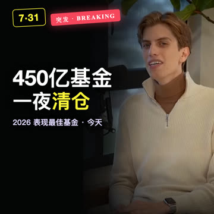 | 07-31 **Leopold 450亿爆仓** | 黑底+实拍开场 | — · — | — · — | [抖音](https://www.douyin.com/video/7668642469067754790) [小红书](https://www.xiaohongshu.com/explore/6a6c7cc20000000025017e8d) |
| 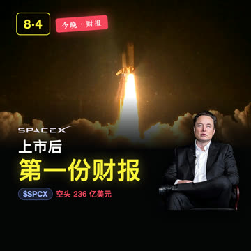 | 08-04 **SpaceX上市后首份财报** | 紫底涟漪 | 162 · 5 | 3884 · 21 | [抖音](https://www.douyin.com/video/7670122038241037578) [小红书](https://www.xiaohongshu.com/explore/6a71bf66000000003301e180) |
| 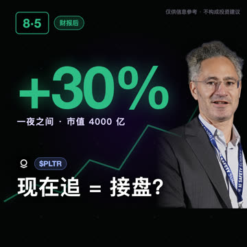 | 08-05 **Palantir财报暴涨30%** | 黑底点阵 | 131 · 2 | 2799 · 15 | [抖音](https://www.douyin.com/video/7670511459692072233) [小红书](https://www.xiaohongshu.com/explore/6a7321a5000000003400d780) |
| 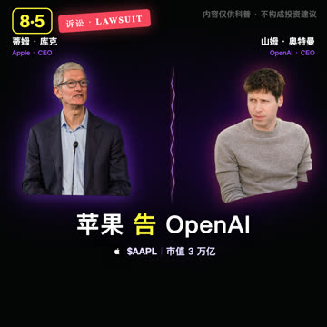 | 08-05 **苹果告OpenAI·45年股价史** | 黑底点阵 | 141 · 1 | 2073 · 5 | [抖音](https://www.douyin.com/video/7670552013830229286) [小红书](https://www.xiaohongshu.com/explore/6a73466c000000003400db20) |
|  | 08-06 **Shopify财报快评** | 黑底点阵 | 151 · 1 | 1567 · 6 | [抖音](https://www.douyin.com/video/7670896138253389083) [小红书](https://www.xiaohongshu.com/explore/6a747f2b000000003300f209) |
| 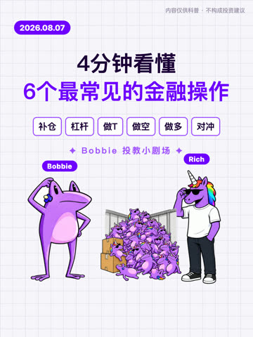 | 08-07 **6个金融股票基础操作** | 贴纸动画 | 8035 · 262 | 3768 · 70 | [抖音](https://www.douyin.com/video/7671193282898103595) [小红书](https://www.xiaohongshu.com/explore/6a758db6000000002202cf32) |
|  | 08-10 **伯克希尔Q2财报** | 黑底点阵 | 112 · 3 | 1688 · 7 | [抖音](https://www.douyin.com/video/7672371533318212890) [小红书](https://www.xiaohongshu.com/explore/6a79bd50000000002500f610) |
| 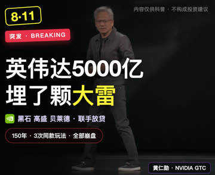 | 08-11 **英伟达5000亿循环融资** | 黑底点阵 | 1975 · 29 | 7084 · 50 | [抖音](https://www.douyin.com/video/7672722362931989810) [小红书](https://www.xiaohongshu.com/explore/6a7afc580000000035015712) |
| 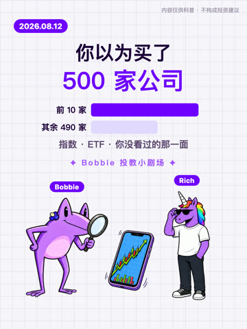 | 08-12 **股票指数和ETF** | 贴纸动画 | 63 · 1 | 1942 · 20 | [抖音](https://www.douyin.com/video/7673106294231895348) [小红书](https://www.xiaohongshu.com/explore/6a7c593e000000003300f9fb) |
| 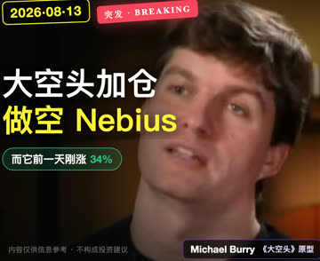 | 08-13 **大空头加仓做空Nebius** | 黑底点阵 | 155 · 2 | 1.4万 · 144 | [抖音](https://www.douyin.com/video/7673484810978954496) [小红书](https://www.xiaohongshu.com/explore/6a7db1c5000000003400d9c8) |
| 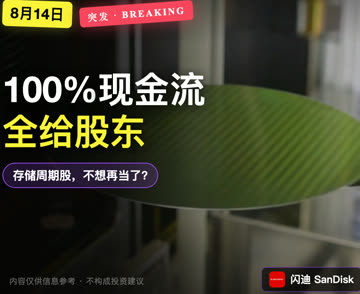 | 08-14 **闪迪投资者日** | 黑底点阵 | 111 · 1 | 1898 · 20 | [抖音](https://www.douyin.com/video/7673830436547693862) [小红书](https://www.xiaohongshu.com/explore/6a7eec1a0000000028031b2e) |
|  | 08-17 **Anthropic十月IPO** | 黑底点阵 | 136 · 1 | 6750 · 86 | [抖音](https://www.douyin.com/video/7674955970715454766) [小红书](https://www.xiaohongshu.com/explore/6a82ebcc000000002202f80f) |
| 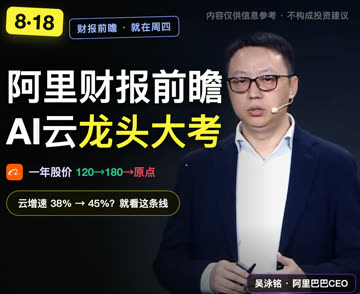 | 08-18 **阿里财报前瞻** | 黑底点阵 | 268 · 4 | 1533 · 22 | [抖音](https://www.douyin.com/video/7675343912336248099) [小红书](https://www.xiaohongshu.com/explore/6a844cad000000002202e9e2) |
|  | 08-19 **宇树上市首日暴涨** | 黑底点阵 | 311 · 7 | 2472 · 12 | [抖音](https://www.douyin.com/video/7675696957876129034) [小红书](https://www.xiaohongshu.com/explore/6a858d990000000025012ba8) |
|  | 08-20 **莫德纳单日涨177%** | 黑底点阵 | 437 · 7 | 4396 · 34 | [抖音](https://www.douyin.com/video/7676066166518975786) [小红书](https://www.xiaohongshu.com/explore/6a86dda200000000330084c7) |
|  | 08-24 **财报如何影响股价** | 米白手账 | 8755 · 118 | 1294 · 30 | [抖音](https://www.douyin.com/video/7677543772825144576) [小红书](https://www.xiaohongshu.com/explore/6a8c1cac000000002a02c4bd) |
| 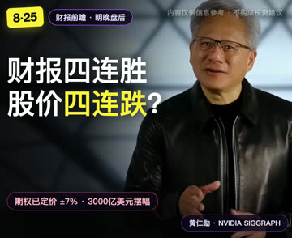 | 08-25 **英伟达Q2财报前瞻** | 黑底点阵 | 1275 · 22 | 5627 · 27 | [抖音](https://www.douyin.com/video/7677930562912357673) [小红书](https://www.xiaohongshu.com/explore/6a8d7d99000000002503b1c7) |
|  | 08-26 **美股港股聪明钱** | 米白手账 | 47.1万 · 1.2万 | 2.5万 · 758 | [抖音](https://www.douyin.com/video/7678293878365080847) [小红书](https://www.xiaohongshu.com/explore/6a8ec789000000000302a1be) |
|  | 08-27 **英伟达买AI界GitHub** | 黑底点阵 | 5788 · 48 | 497 · 2 | [抖音](https://www.douyin.com/video/7678664058974899498) [小红书](https://www.xiaohongshu.com/explore/6a90182e000000000502a6fe) |
| 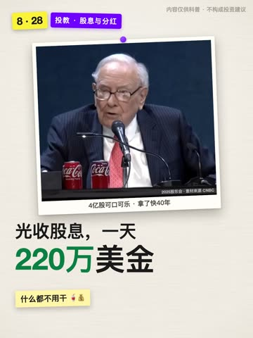 | 08-28 **美股股息与分红** | 米白手账 | 2211 · 102 | 2.1万 · 233 | [抖音](https://www.douyin.com/video/7679027675154959625) [小红书](https://www.xiaohongshu.com/explore/6a91630b0000000020038017) |
|  | 08-31 **本周财报前瞻（博通戴尔）** | 黑底点阵 | 7981 · 60 | 1226 · 7 | [抖音](https://www.douyin.com/video/7680171627069459763) [小红书](https://www.xiaohongshu.com/explore/6a95738a0000000005028031) |
|  | 09-01 **德鲁肯米勒30年不亏** | 米白手账 | 1.2万 · 223 | 2256 · 84 | [抖音](https://www.douyin.com/video/7680531304831667483) [小红书](https://www.xiaohongshu.com/explore/6a96bab2000000002600b2f1) |
| 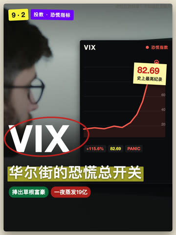 | 09-02 **VIX恐慌指数** | 米白手账 | 6.1万 · 1018 | 4925 · 61 | [抖音](https://www.douyin.com/video/7680902300176600326) [小红书](https://www.xiaohongshu.com/explore/6a980bfd000000002603386c) |
|  | 09-03 **美股熔断** | 米白手账 | 11.4万 · 1159 | 4631 · 26 | [抖音](https://www.douyin.com/video/7681257457259220239) [小红书](https://www.xiaohongshu.com/explore/6a994f090000000026019084) |
|  | 09-04 **财报造假三信号** | 米白手账 | 1.2万 · 185 | 2176 · 13 | [抖音](https://www.douyin.com/video/7681625528922672435) [小红书](https://www.xiaohongshu.com/explore/6a9a9ddc00000000280330eb) |
|  | 09-07 **Anthropic IPO深度（上）** | 米白手账 | 5554 · 62 | 4175 · 71 | [抖音](https://www.douyin.com/video/7682745430966308131) [小红书](https://www.xiaohongshu.com/explore/6a9e985c0000000028032ca1) |
|  | 09-08 **芯片股反弹三把尺子** | 米白手账 | 2.5万 · 331 | 900 · 13 | [抖音](https://www.douyin.com/video/7683122781717925171) [小红书](https://www.xiaohongshu.com/explore/6a9fefd90000000026009d4b) |
|  | 09-09 **美国政府持仓英特尔** | 米白手账 | 6.9万 · 771 | 174 · 1 | [抖音](https://www.douyin.com/video/7683465942864547081) [小红书](https://www.xiaohongshu.com/explore/6aa127900000000026038663) |
|  | 09-10 **苹果发布会魔咒** | 米白手账 | 9669 · 114 | 552 · 10 | [抖音](https://www.douyin.com/video/7683843609967299890) [小红书](https://www.xiaohongshu.com/explore/6aa27eef000000002901555a) |
| 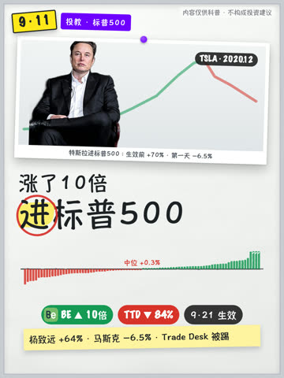 | 09-11 **进标普500是利好还是见光死** | 白板马克笔 | 617 · 19 | — · — | [抖音](https://www.douyin.com/video/7684234024776142090) |
| 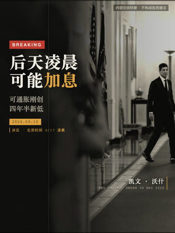 | 09-14 **CPI与议息：通胀新低却可能加息** | 纪录片胶片 | 1.9万 · 97 | — · — | [抖音](https://www.douyin.com/video/7685700536565304586) |
| 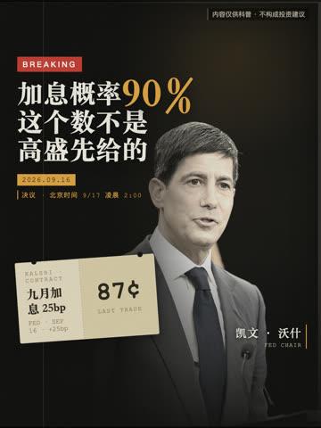 | 09-16 **预测市场加息定价** | 纪录片胶片 | 1.3万 · 94 | — · — | [抖音](https://www.douyin.com/video/7686101994079112457) |
| 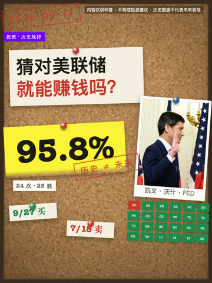 | 09-17 **中期选举规律与美联储加息** | 侦探线索板 | 14.1万 · 2776 | — · — | [抖音](https://www.douyin.com/video/7686470616605576474) |
|  | 09-18 **美股四巫日** | 线索板 | 1030 · 22 | — · — | [抖音](https://www.douyin.com/video/7687462341826383155) |
| 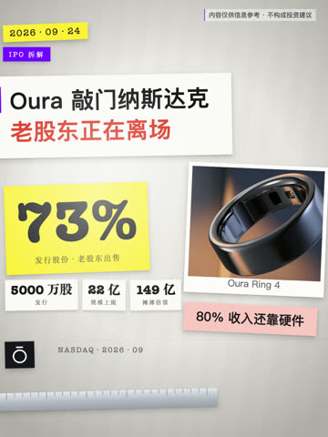 | 09-24 **Oura 上市：73% 是老股东在卖** | 俯拍拆解台 | 3288 · 31 | — · — | [抖音](https://www.douyin.com/video/7689021966082198799) |
| 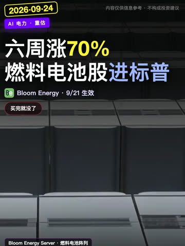 | 09-24 **Bloom Energy 六周涨 70%** | 黑底点阵竖版 | 872 · 14 | — · — | [抖音](https://www.douyin.com/video/7689052096422874403) |


</details>

<br/>

## 横屏知识短片（无口播）

<table><tr>
<td>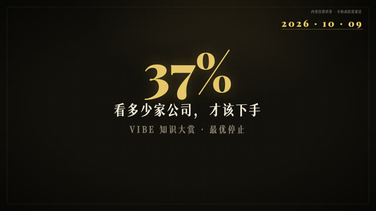<br/><sub><b>《37% 法则》</b> 看多少家公司，才该下手（最优停止，Flood 1949 → Chow 等 1964）</sub></td>
<td>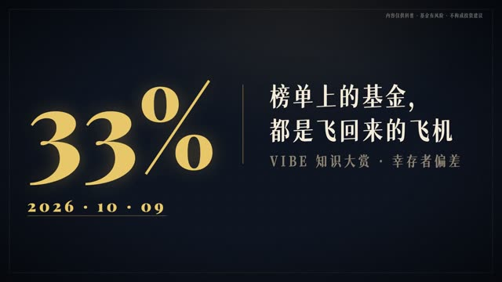<br/><sub><b>《幸存者偏差》</b> 榜单上的基金，都是飞回来的飞机（Wald 1943 · SPIVA 2024：20 年只有 33% 存活）</sub></td>
<td>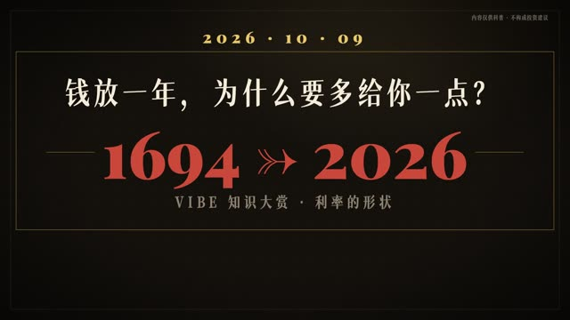<br/><sub><b>《利率的形状》</b> 1694 → 2026 九个节点（英格兰银行 8% → 沃尔克 20% → 零利率 → 3.75–4%）</sub></td>
</tr></table>

<p align="center"></p>

对标 #vibe知识大赏 头部格式做的产品线：横屏 2–3 分钟、无口播、一行字幕即脚本、年份 HUD + 文献角标 + 片尾文献卡。`kfilm/` 引擎把一份 storyboard（约 60 行字幕 + 15 个场景对象，不写场景代码）同时渲成 1920×1080 和 1080×1920；皮肤 `museum`。三支样片的 storyboard 在 `kfilm/films/`，赛道调研结论在 `agent/expand.md` §F。

<p align="center">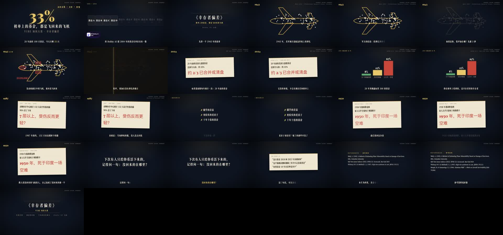</p>

<br/>

## 它怎么工作

<p align="center"></p>

- **决策引擎**（`agent/decide.md`）：先给内容打 8 个标签（意图 / 时效 / 抽象度 / 数据形态 / 主角 / 素材 / 情绪 / 平台），再定 **格式**（20 种）× **皮肤**（按台账避开最近用过的）× **主技术**（实拍 / 数据可视化 / MG / 3D / 贴纸 / 录屏 / AI 生成）；每句口播标一个**画面功能**（认人 · 砸数 · 看变化 · 比大小 · 讲机制 · 追流向 · 转折 …）再选手法，转场必须写明"带过去的元素"。
- **第 4 步是硬闸门**：文字分镜表没点头，不写一行代码。
- **QC 三件**：`pace_check`（视觉节奏）· `cover_diff`（首帧查重，回测抓出了被限流那一对：相似度 1.000）· 审片卡（干净上下文的 subagent 打分，不自评）。发布后 `retention_curve` 把完播曲线拆成开场漏 / 断崖 / 匀速三类回写规则。

<br/>

## 8 套视觉皮肤

<p align="center">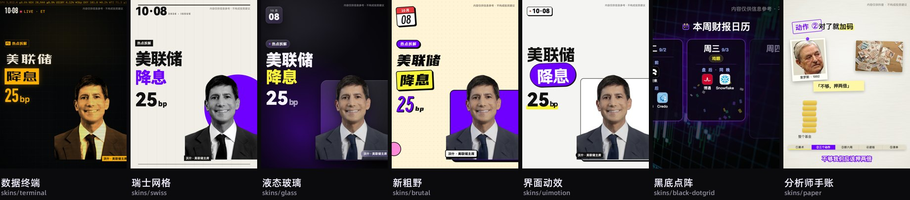</p>

同一份分镜换一行 `import` 就是另一套片子。每套 `skins/<id>/kit.jsx` 实现同一组导出（`Backdrop · Enter · Headline · Hero · Label · Delta · Mark · Stamp · Panel · Photo · DateMark · ChapterMark · Wipe · Disclaimer`），`skins/_showcase` 用同一份三拍分镜渲每套样张。

<p align="center">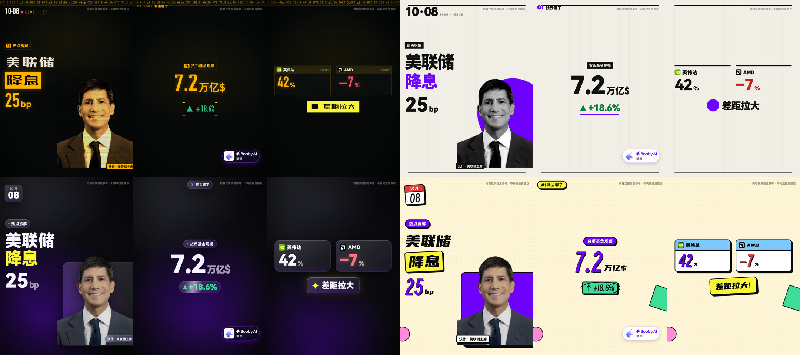</p>

<br/>

## 组件库 motionkit

<p align="center">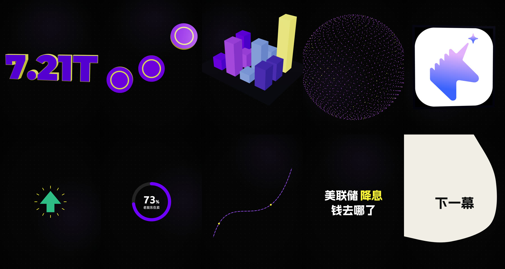</p>
<p align="center"><sub>上：立体数字 · 硬币 · 等距数据城市 · 粒子聚合 · 3D 卡片 ｜ 下：图形变形 + 放射线 · 环形占比 · 流动线 · 逐词动态字 · 液态揭示</sub></p>

<p align="center">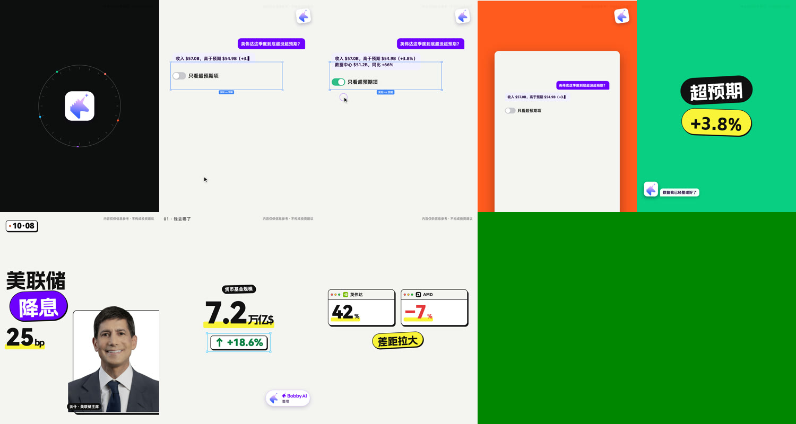</p>
<p align="center"><sub>上：logo 轨道环 → 对话气泡 + 光标点开关 + 选框 → 上一场缩成卡片 + 按幕换底 → 贴纸大字 + 常驻小伙伴 ｜ 下：界面动效皮肤三拍</sub></p>

| | |
|---|---|
| 镜头 · 切点 · 幕间 | `Camera / Punch / Parallax` · `Shot`（cut-the-curve / zoom / pull）· `LeakAt` 光漏 · `ColorFlood` 按幕换底 · `Carry` 共享元素 · `NestZoom` 缩成卡片 |
| MG · 金融 · 界面 | `Morph · Burst · Ring · FlowLine · KineticWords · LiquidReveal · Lottie` · `Candles` K 线 · `SplitFlap` 翻牌 · `Cursor · SelectionBox · Toggle · ChatBubble · StickerPill · OrbitRing` · `BobbyBuddy` |
| 3D · 音效 · 字体 | `Number3D · Coin3D · IsoCity3D · Particles3D · Card3D · Bars3D · Globe3D`（`--gl=angle`）· `SfxTrack` + 7 种程序合成音效 · `type.js` 19 款字体 / 8 组配对 / 投放安全组 |

<p align="center">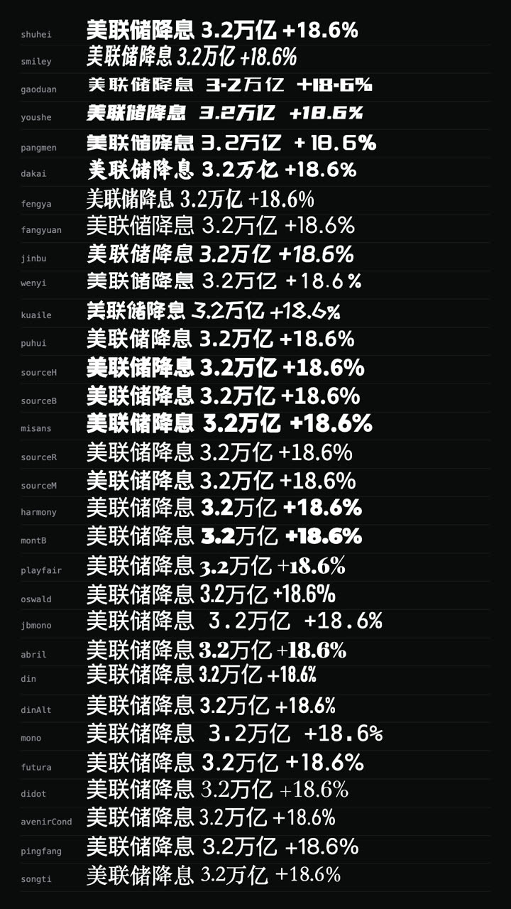</p>

<br/>

## 使用

```bash
git clone https://github.com/wcy4213/voiceover-motion-video.git video-agent && cd video-agent
ln -s "$(pwd)/agent" agent        # skill 入口 agent/SKILL.md
pip install funasr soundfile librosa numpy pillow && brew install ffmpeg
pnpm add remotion@4.0.438 @remotion/{cli,noise,paths,shapes,transitions,motion-blur,three,light-leaks,captions,lottie}@4.0.438 three@0.185 @react-three/fiber@9 @react-three/drei@10 three-globe lottie-web
bash public/fonts/fetch_fonts.sh                            # 补下载未随仓库分发的字体
```

然后在 Claude Code 里说一句「做一条「美联储降息 25bp 美股反跌」的抖音 75 秒视频」，agent 先回**制作单 + 文字分镜表**，你点头后才搭工程。

```
agent/        SKILL.md 入口 · decide 决策引擎 · craft/（20 格式 · 留存 · 美术 · 皮肤台账 · 字体许可）· pipelines/ · script/ · scripts/
motionkit/    组件库 + demo        skins/   7 套皮肤 + _showcase        public/   OFL 字体 · 音效 · 示例 logo
template/     独立最小 Remotion 工程        assets/   配图 · 44 支封面 · videos.json
```

<br/>

## 迭代

| | | |
|---|---|---|
| **v5** | 2026-10-09 | 6 个 skill 合并成一个 agent；决策引擎、23 格式、留存与美术手册；7 套契约皮肤、字体系统（逐款许可核验）；3D / MG / 音效 / 幕间 / 界面道具；节奏体检 · 封面查重 · 完播诊断 · 节拍网格；`kfilm` 知识短片引擎 + 三支样片；接入 remotion-dev/skills 等 GitHub 技能；抖音两轮调研（585 + 245 条） |
| v4 | 09-02 | 黑底点阵 / 分析师手账两套皮肤、motionkit、烧录字幕、排版自动质检、实拍开场模板 |
| v3 | 07-24 | 首帧防同质化规范（被限流后）、B-roll 素材管线与版权红线 |
| v2 | 07-22 | 转场分层级、字幕安全区、文字上限、过冲上限、高管出场组件 |
| v1 | 07-21 | 转写 → 分镜 → 确认 → Remotion → 抽帧 → 渲染，首支成片 |

<br/>

<sub>**许可**：代码与文档 MIT。仓库只随附 SIL OFL 字体，其余从官方下载（`public/fonts/README.md`，逐款结论见 `agent/craft/fonts-license.md`）；音效为程序合成；Remotion 对营利组织有 Company License 要求，请自行确认。内部逐条规则清单、脚本语料、第三方参考原文未随仓库分发。<br/>
**Credits**：由 [Claude Code](https://claude.com/claude-code) 全程构建 · [FunASR / SenseVoice](https://github.com/modelscope/FunASR) · [Remotion](https://remotion.dev) · [three.js](https://threejs.org) · [librosa](https://librosa.org) · 动效法则参考 [remotion-dev/skills](https://github.com/remotion-dev/skills) · [hyperframes](https://github.com/heygen-com/hyperframes) · [motionmaxxing](https://github.com/Tejashmakwana/motionmaxxing) · [video-shotcraft](https://github.com/Vincentwei1021/video-shotcraft) · [LottieFiles motion-design-skill](https://github.com/LottieFiles/motion-design-skill) · [vibe-motion/skills](https://github.com/vibe-motion/skills)</sub>
